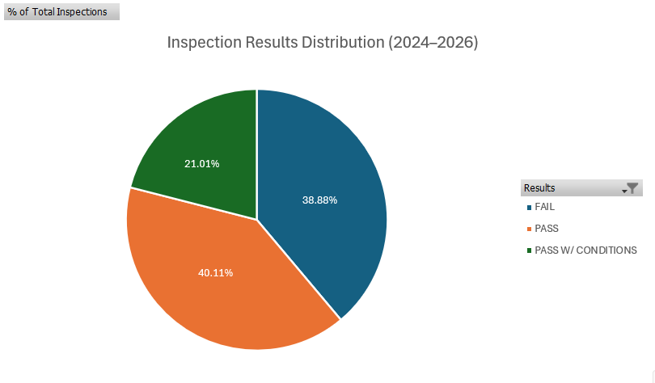
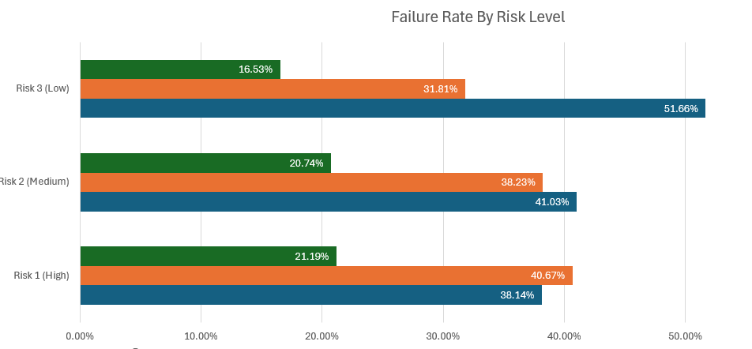
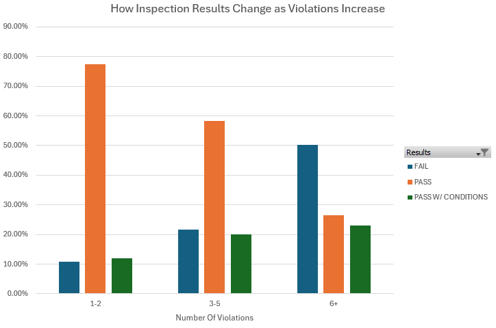
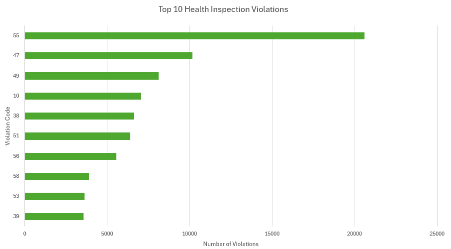
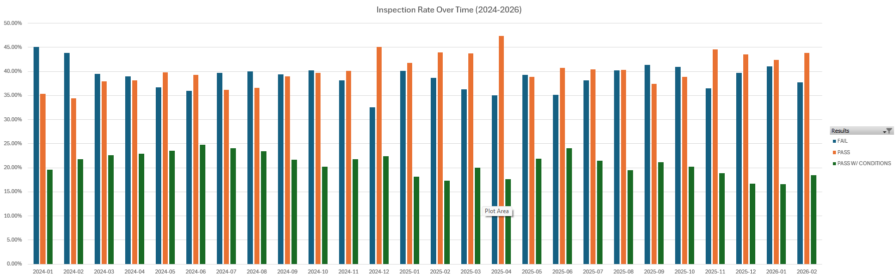
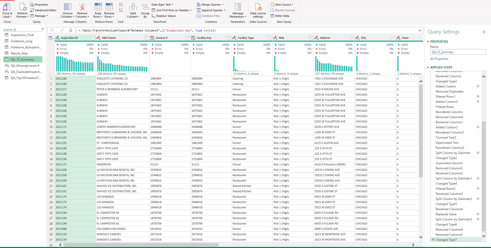

# Chicago Restaurant Health Inspection Analysis (2024–2026)

**Tools:** Excel · Power Query · Pivot Tables · Power BI
**Dataset:** City of Chicago Open Data Portal
**Records Analyzed:** 39,365 inspections · 0 duplicates found

---

## Project Summary

I pulled restaurant health inspection data from Chicago's open data portal to look at compliance trends and figure out what actually drives inspection outcomes. The data was messy — inconsistent formatting, mixed violation strings, and columns that needed significant reshaping before analysis was possible.

The cleaning and transformation work was done entirely in Power Query before building pivot-based analysis in Excel.

---

## Questions I Was Trying to Answer

- How are inspections distributed across Pass, Fail, and Pass w/ Conditions?
- Does the assigned risk level predict failure?
- How does violation count relate to outcome?
- Which specific violations come up most often?
- Are outcomes stable over time or shifting?

---

## Dashboard


---

## Findings

### 1. Most Inspections Don't Simply Pass or Fail



Of the 39,365 inspections analyzed:

- **40.11%** passed outright
- **38.88%** failed
- **21.01%** passed with conditions

Nearly 60% of inspections resulted in something other than a clean pass. That's a meaningful signal on its own.

---

### 2. Risk Level Doesn't Predict Failure the Way You'd Expect



Risk 1 (High) facilities don't have the worst failure rates — Risk 3 (Low) facilities actually fail at a **51.66%** rate compared to **38.14%** for high-risk. This was unexpected and suggests the risk classification may reflect food-handling complexity more than operational compliance.

---

### 3. Violation Count Is the Strongest Predictor of Failure



This was the clearest pattern in the data:

| Violation Count | Fail Rate |
|---|---|
| 1–2 | ~10% |
| 3–5 | ~21% |
| 6+ | ~50% |

At 6+ violations, failure becomes a coin flip. This makes violation count a practical early-warning indicator.

---

### 4. A Small Set of Violations Drive Most Issues



Violation Code **#55** appeared over **20,500 times** — nearly double the next most common violation. The top 3 codes accounted for a significant share of all recorded violations. These cluster around sanitation, temperature control, and contamination prevention.

---

### 5. Outcomes Are Stable Month-to-Month



Looking across Jan 2024 through Feb 2026, there's no major upward or downward trend in any outcome category. Fail rates fluctuate slightly but stay in a consistent range. There's no obvious seasonal spike worth calling out yet.

---

## Data Cleaning (Power Query)



Raw data required:

- Removing irrelevant columns and standardizing field names
- Parsing the violations string column into usable violation counts
- Filtering out non-restaurant facility types
- Standardizing date formats for time-series analysis
- Handling blank/null values in risk and result fields

---

## What This Suggests

- Violation count is more actionable than risk level as a predictor of failure
- A small set of violation codes accounts for a disproportionate share of the problem
- Low-risk facilities may be under-prepared compared to high-risk ones
- Outcome distributions are consistent enough that deviations would be easy to spot

---

## Recommendations

1. **Focus training on the top violation codes** — fixing code #55 alone would address a massive chunk of the violation volume
2. **Use violation count as a triage signal** — facilities hitting 4+ violations in a single inspection should be flagged for follow-up
3. **Revisit low-risk facility oversight** — the data suggests they're not performing as well as their classification implies
4. **Set up a repeat-offender tracking process** — this analysis doesn't yet capture whether the same facilities keep failing

---

## Next Steps

- [ ] Write SQL queries to identify repeat offenders and re-inspection patterns
- [ ] Map violation codes to their actual descriptions for clearer reporting
- [ ] Build an interactive Tableau dashboard for geographic and trend exploration
- [ ] Investigate whether specific zip codes or neighborhoods skew the results

---

## Project Structure

```
Chicago_food_inspection_project/
│
├── 01_raw/                   # Original CSV from Chicago data portal
├── 02_outputs/               # Charts and dashboard exports
├── 03_working/               # Excel workbook with Power Query and pivot tables
├── Dashboard.pbix            # Power BI dashboard file
└── README.md
```

---

*Data source: [Chicago Food Inspections – City of Chicago Data Portal](https://data.cityofchicago.org/)*
